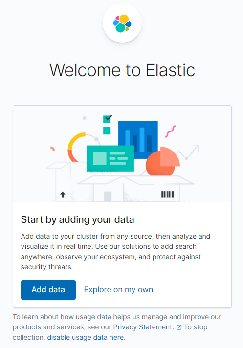

## 🧰 준비물

- Elasticsearch v7.x
- Kibana v7.x
- Filebeat v7.x
- Ubuntu 18.04.x LTS
- Docker
- Docker Compose

## 무슨 상황이었나?

사내 프로젝트로 운영하고 있는 여러 API Server들이 있다. 매일 1 개 이상의 요청/응답/에러 이벤트가 발생하며 그 이벤트는 Log 파일에 기록하거나 MariaDB 테이블에 저장하고 있다. 

로그는 추후 이슈가 발생했을 때 원인을 파악하기 위해 가장 먼저 확인하는 데이터다. 기본적으로 앱에서 발생하는 모든 이벤트를 기록하기 때문에 하루 동안 쌓이는 양만 해도 적지 않다. 이슈를 신속하게 해결하기 위해서는 특정 이벤트를 빠르고 알맞게 검색할 수 있어야 한다.

### vim

vim을 이용한 로그파일의 탐색은 직접 쿼리를 입력해주어야 하는 것이 불편했다. 특정 값에 대해 일괄적으로 집계할 수도 없었다. 그리고 항상 파일을 확인하려면 앱이 구동되고 있는 로컬 머신에 접근해야 했다.

### MariaDB

MariaDB에 저장하는 경우 로그파일보다는 검색이 수월했다. 다만 DB에 로그를 저장하기 위해 매 요청마다 API Server 내에서 직접 DB에 접근하여 저장하는 구조라 요청이 몰리는 때에 조금이라도 성능에 영향이 갈 것 같아 맘에 들지 않았다.

또한 API 마다 각각의 DB 서버에 저장하고 있기 때문에 하나의 플랫폼에서 관리한다면 팀적으로 접근이 더 편할 것 같다는 생각이 들었다.

이런 고민을 하며 검색을 하던 중, Elastic Stack을 발견했다.

## Elastic Stack?


Elastic Stack(이하 `Stack`)은 모든 형식, 모든 소스에서 데이터를 가져와 실시간으로 검색, 분석, 시각화할 수 있도록 고안된 Elastic의 오픈 소스 제품 그룹이다. 


이전에는 'ELK Stack'으로도 불렸으나 기존 Stack을 구성하던 **E**(Elasticsearch), **L**(Logstash), **K**(Kibana) 외에도 **Beats**가 추가되면서 명칭이 변경되었다.

> 💡 `Elastic Stack`이 지원하는 자세한 기능은 [여기를](https://www.elastic.co/kr/elastic-stack) 참고할 수 있다.

### 제품 그룹

Stack을 구성하는 제품들은 기본적으로 무료 사용이 가능한 오픈 소스다. 사용자가 직접 설치하여 사용할 수 있다. 유료 모델은 클라우드를 통해 서비스를 제공한다.

#### Elasticsearch


[Elasticsearch](https://www.elastic.co/guide/en/elasticsearch/reference/current/elasticsearch-intro.html)는 Stack의 핵심기능이다. Apache Lucene을 기반으로 구축된 분산형 RESTful 검색 및 분석 엔진으로써 다양한 형식의 문서 파일을 검색하고 색인화할 수 있다.

#### Logstash

[Logstash](https://www.elastic.co/guide/en/logstash/current/introduction.html)는 실시간 파이프 라이닝*을 제공하는 데이터 수집 엔진이다. 

서로 다른 소스의 데이터를 동적으로 통합하고, 원하는 방식으로 정규화하여 Elasticsearch에 저장하기 적합한 형태로 가공한다. 

> 💡 `파이프라인(Pipeline)`: 하나의 데이터 처리 단계의 출력이 다음 단계의 입력으로 이어지는 형태로 연결된 구조를 가리킨다.

#### Beats

[Beats](https://www.elastic.co/guide/en/beats/libbeat/current/beats-reference.html)는 운영 데이터를 Elasticsearch로 전송하기 위해 서버에 설치하는 경량 데이터 전달자다. 

Beats를 통해 수집한 데이터는 Elasticsearch로 직접 전송해 바로 저장하거나, Logstash로 전송해 추가적인 데이터 가공을 할 수도 있다. Elastic은 데이터의 유형에 따라 다양한 Beats를 제공한다. 

나는 로그 파일 전용 수집기인 [Filebeat](https://www.elastic.co/kr/beats/filebeat)를 사용했다.


#### Kibana

[Kibana](https://www.elastic.co/guide/en/kibana/current/introduction.html)는 대량 스트리밍 및 실시간 데이터에 특화된 데이터 시각화 및 탐색 도구다. 포털 형태의 서비스를 제공하며, 그래픽 표현을 통해 거대하고 복잡한 데이터 스트림을 보다 쉽고 빠르게 모니터링할 수 있도록 한다.

Kibana는 Elasticsearch를 데이터 저장소로 사용하도록 설계됐다. 데이터는 구조화되거나 구조화되지 않은 텍스트, 숫자, 시계열 데이터, 지리 공간 데이터, 로그, 메트릭, 보안 이벤트 등 다양한 형식을 포함한다. 

## 🤨 로그 수집 그거 어떻게 하는 건데

Stack은 아래와 같은 흐름으로 로그를 수집하고 관리한다. 

- 수집 - 여러 데이터 소스에서 로그를 수집하고 전달
- 가공 - 수월한 분석을 위해 로그 메시지를 정규화
- 저장 - 로그 데이터 저장 및 색인화
- 검색 및 분석 - 데이터를 검색하거나 데이터들을 바탕으로 시각화 및 대시 보드를 생성하여 분석한다.

각 과정을 담당하는 제품은 다음과 같다.


## 설치

나는 App 자체에서 구조화된 로그를 출력했기 때문에 별도의 가공 단계가 필요가 없었다. Logstash를 제외한 Elasticsearch, Kibana, Filebeat만 설치했다.

Linux 환경에서 진행했으며 설치 방법은 OS에 따라 상이하다.


- Filebeat: 로그 수집
- ~~Logstash: 로그 데이터 가공~~
- Elasticsearch: 로그 데이터 저장 및 인덱싱
- Kibana: 로그 데이터의 검색 및 분석, 시각화

### with Docker

간편한 구현과 세부 설정을 위해 Elastic에서 제공하는 Docker image를 이용해 Elasticsearch와 Kibana를 설치했다.

- [Docker를 이용한 설치 가이드](https://www.elastic.co/guide/en/elastic-stack-get-started/current/get-started-docker.html)

Docker Compose를 이용해 설치했다. 내가 작성한 compose 파일은 아래와 같다.

```yaml:title=docker-compose.yml
version: '3.0'
services:
  es01:
    image: docker.elastic.co/elasticsearch/elasticsearch:7.11.2
    container_name: es01
    environment: 
      - node.name=es01
      - cluster.name=es-docker-cluster
      - discovery.seed_hosts=es02,es03
      - cluster.initial_master_nodes=es01,es02,es03
      - bootstrap.memory_lock=true
      - "ES_JAVA_OPTS=-Xms512m -Xmx512m"
    ulimits: 
      memlock:
        soft: -1
        hard: -1
    volumes:
      - data01:/data/db/elastic_stack/elasticsearch/data
    ports:
      - 9200:9200
    networks:
      - elastic

  es02:
    image: docker.elastic.co/elasticsearch/elasticsearch:7.11.2
    container_name: es02
    environment: 
      - node.name=es02
      - cluster.name=es-docker-cluster
      - discovery.seed_hosts=es01,es03
      - cluster.initial_master_nodes=es01,es02,es03
      - bootstrap.memory_lock=true
      - "ES_JAVA_OPTS=-Xms512m -Xmx512m"
    ulimits: 
      memlock:
        soft: -1
        hard: -1
    volumes:
      - data02:/data/db/elastic_stack/elasticsearch/data
    networks:
      - elastic
  
  es03:
    image: docker.elastic.co/elasticsearch/elasticsearch:7.11.2
    container_name: es03
    environment: 
      - node.name=es03
      - cluster.name=es-docker-cluster
      - discovery.seed_hosts=es01,es02
      - cluster.initial_master_nodes=es01,es02,es03
      - bootstrap.memory_lock=true
      - "ES_JAVA_OPTS=-Xms512m -Xmx512m"
    ulimits: 
      memlock:
        soft: -1
        hard: -1
    volumes:
      - data03:/data/db/elastic_stack/elasticsearch/data
    networks:
      - elastic

  kib01:
    image: docker.elastic.co/kibana/kibana:7.11.2
    container_name: kib01
    ports:
      - 5601:5601
    environment:
      ELASTICSEARCH_URL: http://10.0.0.85:9200
      ELASTICSEARCH_HOSTS: '["http://10.0.0.85:9200"]'

volumes:
  data01:
    driver: local
  data02:
    driver: local
  data03:
    driver: local

networks:
  elastic:
    driver: bridge

```

Kibana 컨테이너의 설정을 하는 부분에서 `ELASTICSEARCH_HOSTS` 필드는 Elasticsearch 노드들 각각의 IP 주소를 입력한다. 노드별로 IP 주소를 생성하지 않을 것이기에 기본 Elasticsearch 접근 주소만 입력했다. 

```yaml
ELASTICSEARCH_HOSTS: '["http://10.0.0.85:9200"]'
```

### vm.max_map_count 값 변경

Docker Compose를 실행하기 전에 Elasticsearch의 정상적인 작동을 위해 `vm.max_map_count` 값을 영구하게 변경해준다. Elastic에서는 `262,144`를 권장한다. 설치 환경이 Linux라면 아래와 같이 설정한다.

```shell
$ vi /etc/sysctl.conf

# 작성
vm.max_map_count=262144
```


파일 수정 후 설정값을 적용한다.

```shell
sysctl -p
```


제대로 변경이 되었는지 확인한다.

```shell
$ sysctl vm.max_map_count

vm.max_map_count = 262144
```

### Docker Compose 실행

이제 컨테이너를 생성해보자. 처음 실행할 땐 각 제품들의 컨테이너가 정상적으로 실행되는지 바로 확인하기 위해 백그라운드 실행(`-d`)을 하지 않았다.

```shell
docker-compose up
```

### Elasticsearch 상태 확인

```shell
curl -X GET "localhost:9200/_cat/nodes?v&pretty"
ip            heap.percent ram.percent cpu load_1m load_5m load_15m node.role  master name 
192.168.128.2           66          52   0    0.20    0.28     0.39 cdhilmrstw -     es03 
192.168.128.3           44          52   0    0.20    0.28     0.39 cdhilmrstw *     es02 
192.168.128.4           22          52   0    0.20    0.28     0.39 cdhilmrstw -     es01
```

### Kibana 상태 확인

브라우저를 켜서 http://127.0.0.1:5601에 접속한다. 정상적으로 설치됐다면 다음과 같은 화면이 뜰 것이다. 



## 마무리

Elastic Stack을 도입하려는 이유와 Stack의 정의, 구성 요소들을 알아보았다. 그리고 Stack의 설치 - Elasticsearch, Kibana - 를 알아보았다. 다음 글에서는 로그 파일을 수집하는 Beats의 정의와 Beats의 설치, 운용 방법들을 알아보자.

---

## 📜 참고

- [What is Elastic Stack? - Definition from WhatIs.com(Website. 2021.04.13)](https://searchitoperations.techtarget.com/definition/Elastic-Stack#:~:text=Elastic%20Stack%20is%20a%20group,that%20data%20in%20real%20time.&text=Elastic%20Stack%20can%20be%20deployed,as%20a%20Service%20(SaaS).)
- [What is Elasticsearch? | Elasticsearch Guide [7.12] | Elastic(Website. 2021.04.13)](https://www.elastic.co/guide/en/elasticsearch/reference/current/elasticsearch-intro.html)
- [Kibana—your window into Elastic | Kibana Guide [7.12] | Elastic(Website. 2021.04.13)](https://www.elastic.co/guide/en/kibana/current/introduction.html)
- [Logstash Introduction | Logstash Reference [7.12] | Elastic(Website. 2021.04.13)](https://www.elastic.co/guide/en/logstash/current/introduction.html)
- [What are Beats? | Beats Platform Reference [7.12] | Elastic(Website. 2021.04.13)](https://www.elastic.co/guide/en/beats/libbeat/current/beats-reference.html)
- [Filebeat overview | Filebeat Reference [7.12] | Elastic(Website. 2021.04.13)](https://www.elastic.co/guide/en/beats/filebeat/current/filebeat-overview.html)
- [파이프라인 (컴퓨팅) - 위키백과, 우리 모두의 백과사전(Website. 2021.04.13)](https://ko.wikipedia.org/wiki/%ED%8C%8C%EC%9D%B4%ED%94%84%EB%9D%BC%EC%9D%B8_(%EC%BB%B4%ED%93%A8%ED%8C%85))
- [Running the Elastic Stack on Docker | Getting Started [7.12] | Elastic(Website. 2021.04.14)](https://www.elastic.co/guide/en/elastic-stack-get-started/current/get-started-docker.html)
- [The Complete Guide to the ELK Stack | Logz.io(Website. 2021.04.14)](https://logz.io/learn/complete-guide-elk-stack/)
