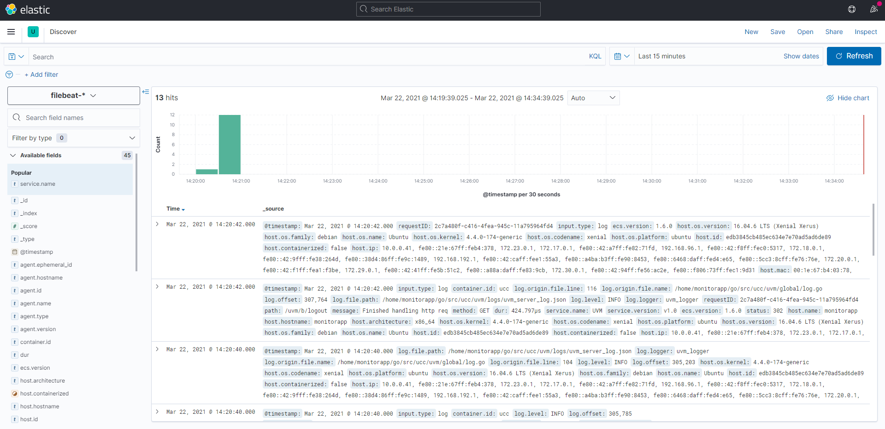
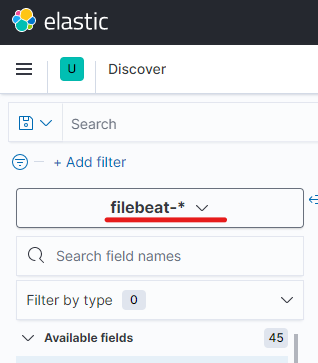
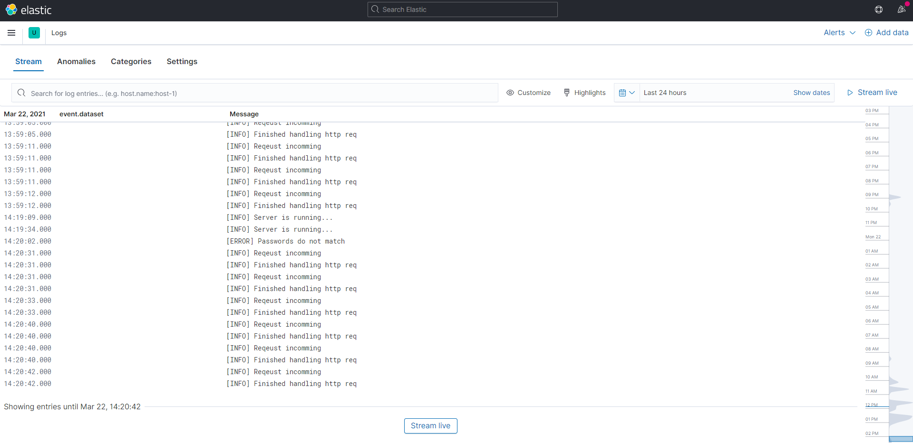
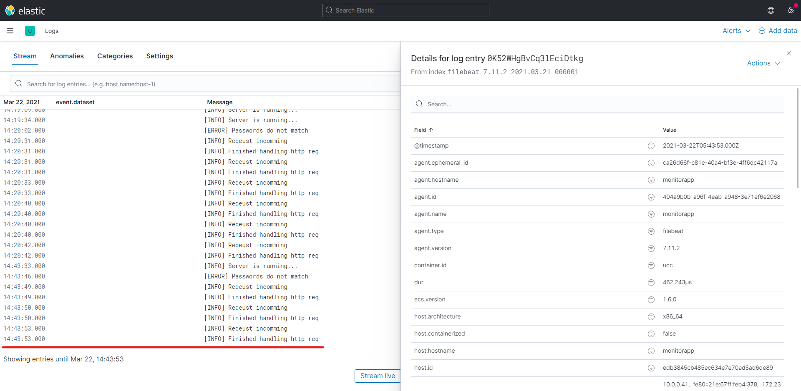

## 🧰 준비물

- Elasticsearch v7.x
- Kibana v7.x
- Filebeat v7.x
- Ubuntu 18.04.x LTS
- Filebeat를 부착할 애플리케이션 서버(Application Server)

앞서 ['Elastic Stack으로 내 App의 Log를 관리해보자(1) - Elasticsearch, Kibana를 Docker로 설치하기'](https://www.gimsesu.me/manage-logs-with-elastic-stack-1)에서 Elastic Stack을 이루는 요소 중 Elasticsearch와 Kibana를 설치해 보았다. 

이번 글에서는 로그(Log) 수집기인 Filebeat를 설치하여 애플리케이션의 로그를 수집하고, Kibana에서 그 결과물을 확인하는 과정을 기술한다.


## 👾 Filebeat가 뭔가요?

[***beat**](https://www.elastic.co/guide/en/beats/libbeat/current/beats-reference.html)는 Elastic에서 제공하는 경량 데이터 전달자를 가리킨다. 수집하는 데이터에 따라 여러 종류의 beats를 제공한다.

그중에서 [Filebeat](https://www.elastic.co/guide/en/beats/filebeat/7.12/filebeat-overview.html)는 `로그(Log)` 수집기다. 로그 데이터를 전달하고 중앙 집중화하는 역할을 한다.

Filebeat는 사용자가 지정한 로그 파일을 감시한다. 갱신되는 로그 이벤트를 수집해서 색인화(저장)를 위해 Elasticsearch나 Logstash로 보낸다.

## 설치

모니터링하려는 애플리케이션이 위치한 장비에 설치해야 한다. Filebeat는 운영 환경에 따라 [다양한 설치 방법](https://www.elastic.co/guide/en/beats/filebeat/7.12/filebeat-installation-configuration.html#other-installation-options)을 제공한다.

나는 앞서 도커 이미지로 설치했던 Elasticsearch, Kibana와 달리 Filebeat는 로컬 환경에 설치했다. (이 방법이 제일 간단해 보였다...)

아래의 명령어를 입력하여 다운로드 후 압축을 푼다. 실제 다운로드 명령어는 [여기](https://www.elastic.co/guide/en/beats/filebeat/7.12/filebeat-installation-configuration.html#installation)를 참고하는 것이 좋다.

```shell
# Linux 환경
curl -L -O https://artifacts.elastic.co/downloads/beats/filebeat/filebeat-7.12.0-linux-x86_64.tar.gz
tar xzvf filebeat-7.12.0-linux-x86_64.tar.gz
```

압축을 해제하면 다음과 같이 구성되어 있다.

```shell
$ l filebeat-7.12.0-linux-x86_64/
LICENSE.txt  README.md  fields.yml  filebeat.reference.yml  kibana/  module/
NOTICE.txt   data/      filebeat*   filebeat.yml            logs/    modules.d/
```

## 설정

Filebeat를 실행하기 전에 몇 가지 설정이 필요하다. 설정은 `filebeat.yml` 파일을 이용한다. 만약 예시를 보고 싶다면 `filebeat.reference.yml`을 참고하면 된다.

크게

1. 로그를 보낼 위치 (Output)
2. 대시보드 사용을 위한 Kibana 엔드 포인트 연결
3. 수집할 로그의 위치 (Input)

을(를) 설정한다.

### 로그를 보낼 위치

나는 Logstash를 거치지 않고 Elasticsearch에 바로 보낼 것이므로 Elasticsearch의 주소를 입력한다.

```yaml
# ============================== Outputs ===============================

# ----------------------- Elasticsearch Output ----------------------- 
output.elasticsearch: 
  # Array of hosts to connect to. 
  hosts: ["10.0.0.85:9200"] 
  # Protocol - either `http` (default) or `https`. 
```

### Kibana 연결

Kibana의 호스트를 설정하면 미리 구축된 Kibana 대시보드를 사용할 수 있다.

```yaml
# =============================== Kibana =============================== 
setup.kibana: 
  host: "10.0.0.85:5601"
  
```

### 수집할 로그의 위치

수집하고 싶은 로그 파일의 위치를 작성한다. 내 애플리케이션의 로그는 `.json` 형식으로 저장하고 있다. Filebeat는 해당 형식의 구문 분석을 [지원한다](https://www.elastic.co/guide/en/beats/filebeat/current/filebeat-input-log.html#filebeat-input-log-config-json).

```yaml
# ========================== Filebeat inputs ==========================
filebeat.inputs: 
[...]
- type: log 
  enabled: true  # 로그 파일 검색 활성화
  paths: 
    - /home/monitorapp/go/src/ucc/uvm/logs/uvm_server_log.json 
  json.keys_under_root: true 
  json.overwrite_keys: true 
  json.add_error_key: true 
  json.expand_keys: true
```


> 💡 `json.*`: JSON 구문 분석 시 사용하는 옵션
>
> 예시가 있으면 이해하기 좋은 옵션들에 대한 설명이다.
>
> - `keys_under_root` : 기본적으로 디코딩된 JSON 구문은 "json" 필드 아래에 위치한다. 이 옵션을 활성화(true)하면 구문을 최상위로 끌어올린다.
>
>   ```json
>   {
>       "type": "test_type",
>       "json": {
>           "type": "log",
>           "text": "hello",
>       }
>   }
>   ```
>
>   to
>   
>   ```json
>   {
>       "type": "test_type",
>       "text": "hello",
>   }
>   ```
>
> - `overwrite_keys`: `keys_under_root` 옵션이 활성화된 상태에서 이 옵션을 활성화하면 "json" 필드 아래 있던 구문의 필드가 기존에 최상위에 있던 필드와 겹칠 경우, 구문의 값이 기존 값을 덮어쓴다.
>
>   ```json
>   {
>       "type": "log",
>       "text": "hello",
>   }
>   ```

## 초기 환경 설정

```shell
./filebeat setup -e
```

Filebeat는 Elasticsearch로 색인 시 권장되는 인덱스 구성을 담은 기본 [인덱스 템플릿(Index template)](https://www.elastic.co/guide/en/elasticsearch/reference/7.12/index-templates.html), [인덱스 수명 주기 관리(ILM)](https://www.elastic.co/guide/en/elasticsearch/reference/current/overview-index-lifecycle-management.html) 정책, Kibana 대시보드 (활성화했을 경우) 등을 불러와 설정한다.

이 부분은 각각의 개념이 낯설어서 추후 테스트를 통해 따로 글을 보충해야 할 듯하다.

## 실행

설정이 끝났다면 Filebeat를 실행한다. 

Elastic은 Filebeat의 [이벤트 발행 권한](https://www.elastic.co/guide/en/beats/filebeat/7.12/privileges-to-publish-events.html)을 최소화할 것을 권장한다. 설정 파일(`filebeat.yml`)의 소유권 및 실행 파일(`filebeat`)의 실행은 해당 호스트에 로그인 한 유저 혹은 `root`로 설정 및 실행한다.

```shell
sudo chown root filebeat.yml
sudo ./filebeat run &
```

Filebeat의 실행 `logs` 디렉터리에서 확인할 수 있다.

```shell
$ sudo tree logs/
logs/
├── filebeat  
└── filebeat.1
```

## 👩‍🎨 Kibana에서 확인

수집한 데이터를 Kibana에서 확인해 볼 차례다. 브라우저를 켜고 설정한 Kibana 주소로 접속한다.

### 1#

첫 페이지에서 `Kibana` > `Discover` 순으로 들어가면 로그를 확인할 수 있다.




Kibana는 Elasticsearch에 접근해 사전에 설정된 `filebeat-*` 인덱스 패턴으로 저장된 데이터를 가져온 것이다.



### 2#

처음 페이지에서 `Observability` > `Logs` 메뉴에서도 로그 데이터를 확인할 수 있다. 





## 결론

Filebeat를 설치하여 로그를 수집하여 저장하고, 최종적으로 Kibana에서 해당 데이터를 확인하는 방법을 알아보았다. 이후 서비스를 운영하며 이슈가 발생하면, Kibana를 이용해 이슈의 원인이 될 만한 로그를 편리하게 검색할 수 있다. 

추후 기본적으로 제공하는 대시보드 구성을 통해 로그 데이터를 시각화하여 효과적으로 관리할 수도 있다.

다음 글에서는 Filebeat가 로그를 수집하는 방법과 그 구조에 대해 알아보자.

---

## 📜참고

- [What are Beats? | Beats Platform Reference [7.12] | Elastic(Website. 2021.04.23)](https://www.elastic.co/guide/en/beats/libbeat/current/beats-reference.html)
- Filebeat Reference [7.12] | Elastic(Website)
  - [Filebeat overview(2021.04.23)](https://www.elastic.co/guide/en/beats/filebeat/7.12/filebeat-overview.html)
  - [Filebeat quick start: installation and configuration(2021.04.23)](https://www.elastic.co/guide/en/beats/filebeat/7.12/filebeat-installation-configuration.html)
  - [Modules overview(2021.04.25)](https://www.elastic.co/guide/en/beats/filebeat/current/filebeat-modules-overview.html)
  - [Filebeat command reference(2021.04.26)](https://www.elastic.co/guide/en/beats/filebeat/current/command-line-options.html#setup-command)
  - [Grant privileges and roles needed for publishing(2021.04.26)](https://www.elastic.co/guide/en/beats/filebeat/7.12/privileges-to-publish-events.html)
  - [Log input(2021.04.27)](https://www.elastic.co/guide/en/beats/filebeat/current/filebeat-input-log.html#filebeat-input-log-config-json)
- Elasticsearch Guide [7.12] | Elastic(Website)
  - [Index templates(2021.04.26)](https://www.elastic.co/guide/en/elasticsearch/reference/7.12/index-templates.html)
  - [ILM overview(2021.04.26)](https://www.elastic.co/guide/en/elasticsearch/reference/current/overview-index-lifecycle-management.html)
